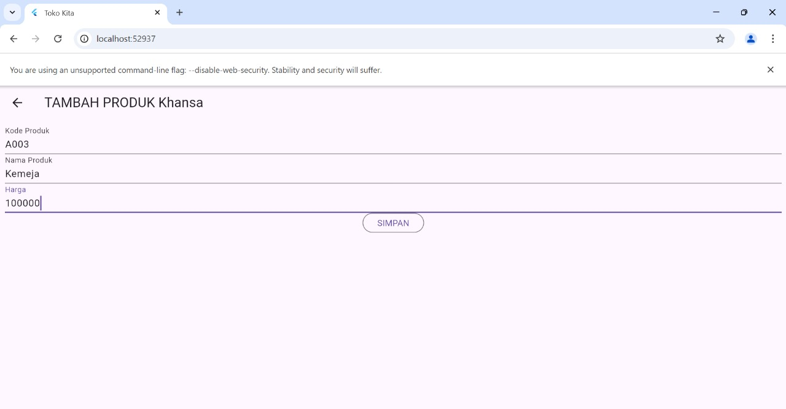

# Screenshot Website Toko Kita Khansa

1. **Tampilan Website Login**  
   
2. **Tampilan Website Registrasi**  
   
3. **Tampilan Website Logout**  
   
4. **Tampilan Website Detail Produk**  
   
5. **Tampilan Website List Produk**  
   
6. **Tampilan Website Tambah Produk**  
   
7. **Tampilan Website Ubah Produk**  
   

# Alur Website Toko Kita Khansa

1. **Proses Registrasi**
   a. Input Data untuk Registrasi
   
   Penjelasan:
   Pada proses ini, pengguna akan mengisi nama, email, password, dan konfirmasi password pada form registrasi. Data ini kemudian dikirim ke server untuk disimpan di database. Kode berikut menangani pengiriman data ke API:

   RegistrasiBloc.registrasi(
   nama: \_namaTextboxController.text,
   email: \_emailTextboxController.text,
   password: \_passwordTextboxController.text
   )

   b. Pop-up Berhasil Registrasi
   
   Penjelasan:
   Setelah berhasil mendaftar, pengguna akan melihat pop-up notifikasi bahwa registrasi berhasil, seperti yang ditampilkan oleh kode berikut:

   showDialog(
   context: context,
   barrierDismissible: false,
   builder: (BuildContext context) => SuccessDialog(
   description: "Registrasi berhasil, silahkan login",
   okClick: () { Navigator.pop(context); }
   )
   );

2. **Proses Login**
   a. Input Data untuk Login
   
   Penjelasan:
   Pengguna mengisi email dan password di halaman login. Data tersebut dikirim ke API untuk proses autentikasi:

   LoginBloc.login(
   email: \_emailTextboxController.text,
   password: \_passwordTextboxController.text
   )

   b. Pop-up Gagal Login
   
   Penjelasan:
   Jika autentikasi gagal (misalnya, email atau password salah), sistem akan menampilkan pesan pop-up gagal login:

   showDialog(
   context: context,
   barrierDismissible: false,
   builder: (BuildContext context) => WarningDialog(
   description: "Login gagal, silahkan coba lagi",
   )
   );

   c. Berhasil Login
   
   Penjelasan:
   Jika login berhasil, pengguna akan diarahkan ke halaman daftar produk:

   Navigator.pushReplacement(
   context,
   MaterialPageRoute(builder: (context) => const ProdukPage())
   );

3. **Proses Tambah Data Produk**
   a. Input Data Produk Baru
   
   Penjelasan:
   Pengguna mengisi kode produk, nama produk, dan harga produk di form tambah produk. Data ini dikirim ke server untuk ditambahkan ke database:

   ProdukBloc.addProduk(
   produk: Produk(
   kodeProduk: \_kodeProdukController.text,
   namaProduk: \_namaProdukController.text,
   hargaProduk: int.parse(\_hargaProdukController.text)
   )
   )

   b. Berhasil Tambah Data
   
   Penjelasan:
   Setelah produk berhasil ditambahkan, pengguna akan diarahkan ke halaman ProdukPage yang menampilkan daftar produk:

   Navigator.of(context).push(MaterialPageRoute(
   builder: (BuildContext context) => const ProdukPage()));

4. **Proses Detail Produk**
   a. Melihat Detail Produk
   
   Penjelasan:
   Saat pengguna memilih produk dari daftar, detail produk akan ditampilkan menggunakan halaman detail:

   Navigator.push(
   context,
   MaterialPageRoute(
   builder: (context) => ProdukDetail(produk: produk)
   )
   );

5. **Proses Ubah Produk**
   a. Input Data untuk Ubah Produk
   
   Penjelasan:
   Pengguna dapat mengubah kode produk, nama produk, atau harga produk di halaman ubah produk. Perubahan ini kemudian disimpan di database:

   ProdukBloc.updateProduk(
   produk: Produk(
   id: produk.id,
   kodeProduk: \_kodeProdukController.text,
   namaProduk: \_namaProdukController.text,
   hargaProduk: int.parse(\_hargaProdukController.text)
   )
   )

   b. Berhasil Ubah Data Produk
   
   Penjelasan:
   Berhasil mengubah nama produk dari Kemeja menjadi Celana. Setelah produk berhasil di ubah, pengguna akan diarahkan ke halaman ProdukPage yang menampilkan daftar produk:

   Navigator.of(context).push(MaterialPageRoute(
   builder: (BuildContext context) => const ProdukPage()));

6. **Proses Hapus Produk**
   a. Konfirmasi Hapus Produk
   
   Penjelasan:
   Saat pengguna mengklik tombol hapus, sebuah dialog konfirmasi akan muncul untuk memastikan apakah pengguna ingin menghapus produk:

   showDialog(
   context: context,
   builder: (BuildContext context) => AlertDialog(
   content: const Text("Yakin ingin menghapus produk ini?"),
   actions: [
   OutlinedButton(
   child: const Text("Ya"),
   onPressed: () {
   ProdukBloc.deleteProduk(id: produk.id)
   Navigator.pop(context);
   }
   ),
   OutlinedButton(
   child: const Text("Batal"),
   onPressed: () => Navigator.pop(context),
   )
   ]
   )
   );

   b. Berhasil Hapus Data Produk
   
   Penjelasan:
   Berhasil hapus data produk Celana. Setelah produk berhasil di hapus, pengguna akan diarahkan ke halaman ProdukPage yang menampilkan daftar produk:
   Navigator.of(context).push(MaterialPageRoute(
   builder: (context) => const ProdukPage()))

7. **Proses Logout**
   a. Tombol Logout
   
   Penjelasan:
   Pengguna dapat logout dari sistem dengan menekan tombol logout. Ini akan menghapus sesi pengguna dan mengarahkan kembali ke halaman login:

   ListTile(
   title: const Text('Logout'),
   onTap: () async {
   await LogoutBloc.logout();
   Navigator.pushAndRemoveUntil(
   context,
   MaterialPageRoute(builder: (context) => LoginPage()),
   (route) => false
   );
   }
   )
